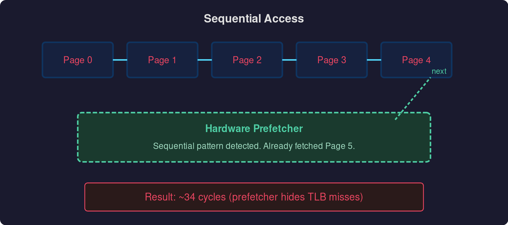
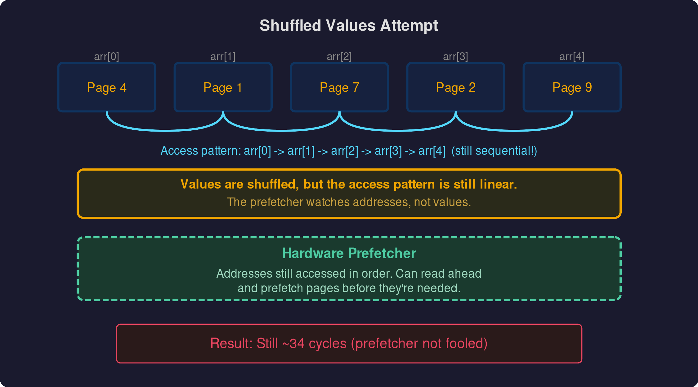
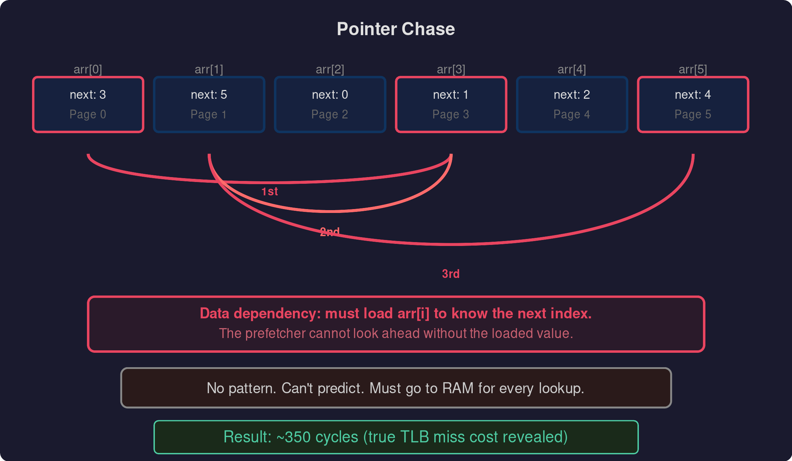

For the homework for chapter 19 of Operating Systems: Three Easy Pieces (OSTEP) you have to discover the size of the TLB caches and the cost of a miss.

### Sequential Access Attempt

The first way I went about doing this was to create an array of integers using malloc with a size of 1000 * PAGESIZE (the size of a page on your computer, which you can get using getpagesize from stdlib.h). Then you calculate how far you have to jump in the array to get to the next page, so that you are hitting a different page with every access and hence having to fetch another page rather than just hitting the cached version. The jump is calculated easily as PAGESIZE / sizeof(int) — since each element in the array is an integer, we need to divide the page size by the size of an integer. To measure cycles accurately I use CPUID before the start timestamp to drain the pipeline this forces all prior instructions to complete so nothing from before the measurement is still in flight. For the end timestamp I use RDTSCP, which waits for all preceding instructions to finish before reading the cycle counter, so the measurement isn't cut short by out-of-order execution.

Now if you were to jump straight into measuring, you would not see a big difference as you scale up the number of pages, topping out at about 34 cycles on my machine when doing 2^40 pages. However, what you would expect to see if there was no hardware prefetching is that once you run out of TLB cache on all levels, you would need multiple RAM accesses to get the physical page number for the virtual page number. On my machine with a 3-level page tree, you would expect 4 RAM accesses and hence about 350 cycles. The reason it tops out at only 36 cycles is the hardware prefetcher — since you are doing a sequential read of an array, it's easy for the prefetcher to predict where you are going next and speculatively load that data into the TLB. Before measuring, I also touch every page in the array once to make sure the OS has actually backed it with physical memory. Without this, you'd be measuring page fault time on top of TLB misses, which would drown out what we're actually trying to see.

### Random Values Attempt

I then tried shuffling the array of page indices so that we should be accessing pages randomly and not in order. However, even though the values in the array are random, the way we access the array is not — we're still iterating through it sequentially. The hardware prefetcher can look ahead in the array and speculatively fetch the pages that are coming up next, so the cycle count doesn't change from the sequential access. The data ends up in the TLB before we need it, so we only ever need one RAM access per page.

### Pointer Chase

The only way to defeat the prefetcher is to create a data dependency: have each element store the index of the next element to access, with the indices randomised. This way the CPU has to wait for the current fetch to complete before it knows where to go next — like traversing a linked list. The prefetcher can't look ahead because the next address depends on data that hasn't been loaded yet. With this approach you can see the exact point where your TLB fills up and when you start paying multiple RAM accesses just to translate a virtual address.

### In Conclusion

You have to be accessing a linked list or some data structure with non-sequential access patterns in order to defeat the hardware prefetcher. This means that most programs will be fine and won't see a performance hit when just accessing elements of an array sequentially. The hardware prefetcher is amazing.

P.S If there any mistakes please let me know I am by no means an expert.
